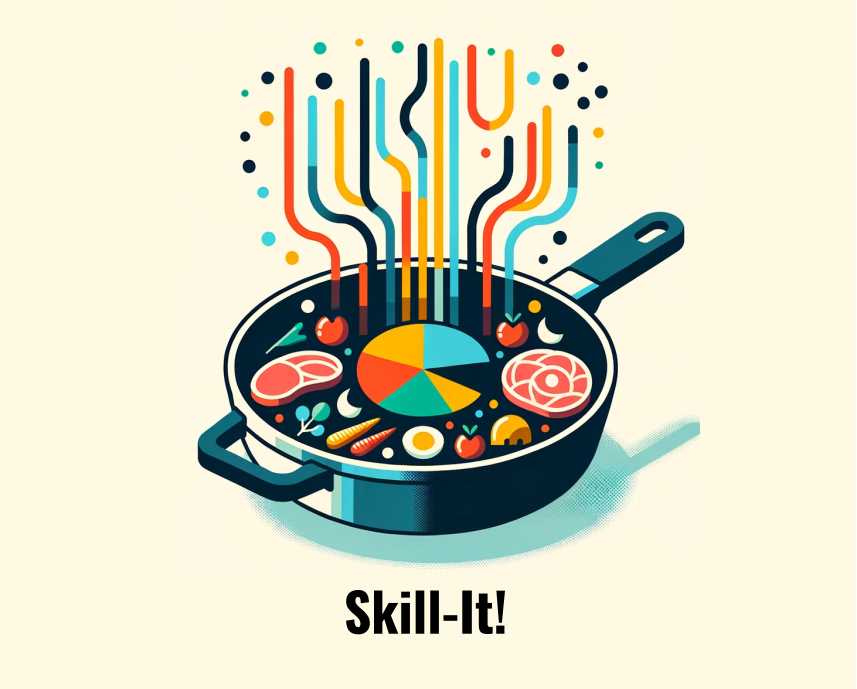

# Skill-It 

<div align="center" >
     

</div>

**Skill-It! A Data-Driven Skills Framework for Understanding and Training Language Models**\
Mayee F. Chen, Nicholas Roberts, Kush Bhatia, Jue Wang, Ce Zhang, Frederic Sala, Christopher Ré.\
 [arxiv](https://arxiv.org/abs/2307.14430), NeurIPS 2023 (Spotlight)


## Overview

Skill-It is a data selection method that dynamically samples over **skills** in the training data. 
Our motivation comes from the observation that humans best acquire skills in a particular interdependent order---so do language models do the same? 
We define skills (e.g. tasks, task categories, domains) for the language model via their associated data and find that we can compute a dependency graph (a **skills graph**) over them that encodes how prerequisite skills help the model unlock more advanced skills.
This skills graph can then be utilized to more effectively sample over a set of training skills to best learn a set of evaluation skills. 
The Skill-It algorithm adjusts the sampling proportion for each skill in the training data based on 1) how influential this skill is for the evaluation skills and 2) the current model loss on the evaluation skills. When the skills graph specifies a clear order over the skills (e.g., the graph is neither complete nor empty), Skill-It is able to attain lower validation loss and higher accuracy than random or stratified sampling in the same number of training steps. In other words, Skill-It is able to attain high accuracy with less data simply by adjusting the order and proportions on the training data.


## How to run

To install the dependencies:
```bash
git clone https://github.com/HazyResearch/skill-it.git
cd skill-it/
pip install -r requirements.txt
```

The scripts for the experiments in the body of the paper (excluding the RedPajama experiment) are in `scripts/{lego, addition, ni, alpaca, law}`. The folder corresponding to each dataset also contains `pt, ft, ood` to specify the continual pre-training, fine-tuning, and out-of-domain settings. Note that `alpaca` and `law` only have sample scripts for running skill-stratified or random sampling.

### Relevant folders

- `aux_data`: contains auxiliary files (used to specify splits, metadata, etc.).
- `dataset`: contains implementations for sampling from each dataset.
- `evaluator`: contains the evaluation code for each dataset.
- `ni_graphs`: includes the skills graphs learned for Natural Instructions, saved as `.npy` files.
- `notebooks`: contains notebooks for visualizing the results for each dataset.
- `scripts`: for running each baseline (random, skill-stratified, curriculum, group curriculum) and Skill-It.
- `trainer`: contains various training algorithms. including a regular training loop, curriculum learning baselines, and Skill-It's online data selection algorithm.

### Guidance on further usage

Here are some tips for trying Skill-It on your own data:
- If you have a HuggingFace training and validation dataset, rename the column on which you define skills to be `slice`, and the column containing your text data to be `text`. Then, `dataset/hf_dataset.py` ought to support sampling from your datasets, and `evaluator/hf_evaluator.py` should support evaluation once `string_columns` is updated to be all non-Tensor fields. Otherwise, you should create a new dataset and evaluator class.
- Code for learning the skills graph is not provided. However, this can be specified quite easily. For example, checking if there is an edge from Skill 2 to Skill 3 in LEGO can be achieved with the following.
```bash
#!/bin/bash
for SEED in 0 1 2 3 4
do 
    python3 main.py \
        --task_name lego \
        --selection_seed ${SEED} \
        --max_steps 6000 \
        --batch_size 32 \
        --sample_rule mixture \
        --context_length 128 \
        --k 5 \
        --proportions 0 1 1 0 0 \
        --num_ckpts 120

    python3 main.py \
        --task_name lego \
        --selection_seed ${SEED} \
        --max_steps 6000 \
        --batch_size 32 \
        --sample_rule mixture \
        --context_length 128 \
        --k 5 \
        --proportions 0 0 1 0 0 \
        --num_ckpts 120
done 
```
- If your skills graph is nearly empty or nearly complete, you should not expect Skill-It to work well, as the skills graph does not suggest a clear order of sampling over the skills. In this case, you should explore using another partition of your data. See paper for details.

## Citation

```
@misc{chen2023skillit,
    title={Skill-it! A Data-Driven Skills Framework for Understanding and Training Language Models},
    author={Mayee F. Chen and Nicholas Roberts and Kush Bhatia and Jue Wang and Ce Zhang and Frederic Sala and Christopher Ré},
    year={2023},
    eprint={2307.14430},
    archivePrefix={arXiv},
    primaryClass={cs.CL}
}
```

## Contact

For questions, comments, or concerns, reach out to Mayee Chen (<mfchen@stanford.edu>).
